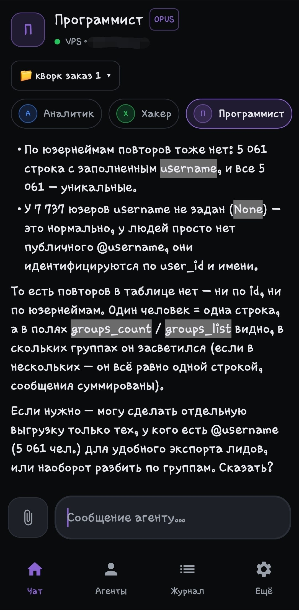
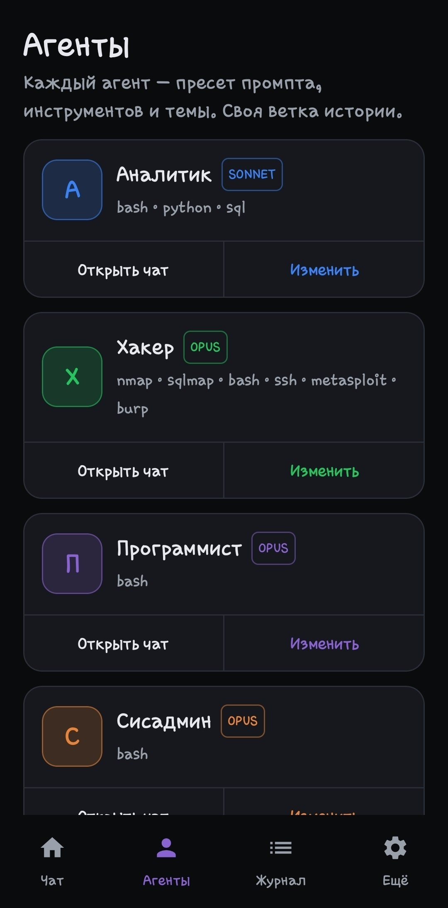

<p align="center">
  
</p>

<h1 align="center">ClawNest</h1>

<p align="center">
  <b>A pocket remote for your own AI coding agents — self-hosted on your VPS.</b><br>
  <b>Карманный пульт к твоим ИИ-агентам — на твоём собственном сервере.</b>
</p>

ClawNest is a native client — **Android, iPhone (iOS) and macOS** — to a Claude-powered agent
daemon that runs on **your** server. The phone is a thin client; the agent, its tools and your
history live on your VPS. No middleman cloud, no domain, no public port — everything rides
inside an SSH tunnel.

<p align="center">
  🌐 <a href="#english">English</a> · <a href="#русский">Русский</a> · 📄 <a href="LICENSE">MIT License</a>
</p>

<p align="center">
  
  &nbsp;&nbsp;
  
</p>
<p align="center"><sub>Chat with a persona · the agents list — each a preset of prompt, tools and model</sub></p>

---

## English

### What it is
A self-hosted "pocket Claude Code": chat with swappable agent **personas** (programmer,
sysadmin, analyst, hacker, …) that can run real commands, read/write files and browse the web
on your own VPS — all from your phone.

### How it works
```
Android (Kotlin/Compose)  ──SSH (JSch)──▶  your VPS
  thin client                              ├─ port-forward ──▶ openclaw agent (Python, websockets)
  no cloud, no domain                      └─ agent drives Claude Code via claude_agent_sdk
```
All agent traffic is tunnelled **inside** the SSH connection (SSH-encrypted), so there's no
public WebSocket port and no VPN to set up. The app provisions the server automatically over
SSH on first connect.

### Features
- 🧑‍💻 **Agent personas** — each is a preset of system prompt, allowed tools and theme, with its
  own persistent history thread.
- 🧠 **Per-agent model** — pick Opus / Sonnet / Haiku per persona.
- 📁 **Projects** — `project × agent` keeps its own isolated, persistent context (survives
  reconnects, restarts and reinstalls); optional shared-context mode.
- 🖼 **Files & photos both ways** — attach files/photos to the agent (it can read images), and
  the agent can send files/photos back (images render inline).
- ❓ **Interactive questions** — when the agent needs a choice, you get tappable options.
- 🔔 **Proactive messages** — the agent can set a background monitor and message you later
  (with a push notification) when an event fires.
- 🗒 **Command audit log** — everything the agent ran on your VPS.
- 🌍 **RU / EN** — switchable in Settings.
- 🔒 Keys and history stay on the device; the agent runs on your own server.

### Build the Android app
Requirements: **JDK 17**, **Android SDK 34**, **Gradle 8.9**.

Debug APK:
```bash
cd android
echo "sdk.dir=$ANDROID_HOME" > local.properties
gradle wrapper --gradle-version 8.9   # once, creates ./gradlew
./gradlew assembleDebug
# → app/build/outputs/apk/debug/app-debug.apk
```

Signed release APK — create `android/keystore.properties` (gitignored):
```properties
storeFile=clawnest-release.jks
storePassword=YOUR_PASSWORD
keyAlias=clawnest
keyPassword=YOUR_PASSWORD
```
and a keystore next to it:
```bash
keytool -genkeypair -v -keystore android/clawnest-release.jks \
  -alias clawnest -keyalg RSA -keysize 2048 -validity 10000
./gradlew assembleRelease
# → app/build/outputs/apk/release/app-release.apk
```

### iOS (iPhone) — install without the App Store
A native **SwiftUI** port of the same thin client lives in [`ios/`](ios). It reaches the same
agent over the same on-device SSH tunnel (via [Citadel](https://github.com/orlandos-nl/Citadel)/
SwiftNIO), streams replies, runs tool/terminal blocks and answers interactive questions — the
phone stays a thin client, no cloud. Because it isn't on the App Store, you build it yourself on
a Mac and **sideload** it onto your iPhone.

Quick start — needs a **Mac with Xcode 15+**, an **Apple ID** and an **iPhone (iOS 16+)**:
```bash
brew install xcodegen
cd ios
xcodegen generate          # project.yml → ClawNest.xcodeproj
open ClawNest.xcodeproj
```
In Xcode: set your **Team** under *Signing & Capabilities*, then either **Run** straight to a
plugged-in iPhone, or **Product ▸ Archive → Distribute** to export an `.ipa` and install it with
**[AltStore](https://altstore.io)** / **[Sideloadly](https://sideloadly.io)** (free Apple ID =
re-sign every 7 days, which AltStore automates; a paid dev account = 1 year). A built-in
**Demo mode** runs the whole UI with no server, so you can try it before wiring up a VPS.
Full step-by-step guide: **[`ios/README-ios.md`](ios/README-ios.md)**.

### Server (backend)
The app installs and configures the agent on your VPS automatically (over SSH) the first time
you connect — just enter the server IP, the SSH password and a Claude key. The daemon lives in
[`backend/openclaw_agent`](backend/openclaw_agent) (Python 3.10+, `claude-agent-sdk`,
`websockets`). It works with a Claude subscription OAuth token (`sk-ant-oat…`) or a plain API
key.

### Connecting
Open the app, fill in **Server IP**, **SSH user/password** and **Claude key (optional)**, tap
connect. The app SSHes in, sets the agent up, forwards its port and opens the chat. Credentials
are saved after the first successful connect, so it reconnects on its own afterwards.

---

## Русский

### Что это
Self-hosted «карманный Claude Code»: чат со сменными **агентами-персонами** (программист,
сисадмин, аналитик, хакер, …), которые умеют запускать реальные команды, читать/писать файлы
и ходить в веб — на твоём собственном VPS, прямо с телефона.

### Как работает
```
Android (Kotlin/Compose)  ──SSH (JSch)──▶  твой VPS
  тонкий клиент                            ├─ проброс порта ──▶ агент openclaw (Python, websockets)
  без облака, без домена                   └─ агент рулит Claude Code через claude_agent_sdk
```
Весь трафик агента идёт **внутри** SSH-соединения (зашифровано SSH) — никакого публичного
WebSocket-порта и никакого VPN. При первом подключении приложение само настраивает сервер по SSH.

### Возможности
- 🧑‍💻 **Агенты-персоны** — у каждой свой системный промпт, набор инструментов, тема и
  отдельная сохраняемая история.
- 🧠 **Модель на агента** — Opus / Sonnet / Haiku для каждой персоны.
- 📁 **Проекты** — `проект × агент` хранит свой изолированный контекст (переживает
  переподключения, рестарты и переустановку); есть режим общего контекста.
- 🖼 **Файлы и фото в обе стороны** — прикрепляй файлы/фото агенту (он видит изображения),
  и агент может присылать файлы/фото обратно (картинки прямо в чате).
- ❓ **Интерактивные вопросы** — когда агенту нужен выбор, появляются кнопки-варианты.
- 🔔 **Сам пишет тебе** — агент может поставить фоновый монитор и написать тебе позже
  (с пуш-уведомлением), когда событие сработает.
- 🗒 **Журнал команд** — всё, что агент выполнял на твоём VPS.
- 🌍 **RU / EN** — переключается в настройках.
- 🔒 Ключи и история — только на устройстве; агент работает на твоём сервере.

### Сборка приложения
Нужно: **JDK 17**, **Android SDK 34**, **Gradle 8.9**. Команды сборки — см. раздел
[Build the Android app](#build-the-android-app) выше (debug и подписанный release).

### iOS (iPhone) — установка без App Store
Нативный **SwiftUI**-порт того же тонкого клиента лежит в [`ios/`](ios). Он ходит к тому же
агенту по тому же SSH-туннелю прямо с устройства (через [Citadel](https://github.com/orlandos-nl/Citadel)/
SwiftNIO), стримит ответы, показывает tool/terminal-блоки и интерактивные вопросы — телефон
остаётся тонким клиентом, без облака. В App Store его нет, поэтому собираешь сам на Mac и
ставишь **сайдлоадом** на iPhone.

Быстрый старт — нужен **Mac с Xcode 15+**, **Apple ID** и **iPhone (iOS 16+)**:
```bash
brew install xcodegen
cd ios
xcodegen generate          # project.yml → ClawNest.xcodeproj
open ClawNest.xcodeproj
```
В Xcode: выставь **Team** в *Signing & Capabilities*, затем либо **Run** на подключённый
iPhone, либо **Product ▸ Archive → Distribute** — выгрузить `.ipa` и поставить через
**[AltStore](https://altstore.io)** / **[Sideloadly](https://sideloadly.io)** (бесплатный
Apple ID — переподпись раз в 7 дней, AltStore делает её сам; платный dev-аккаунт — на год).
Встроенный **демо-режим** показывает весь интерфейс без сервера — можно попробовать до
настройки VPS. Полный пошаговый гайд: **[`ios/README-ios.md`](ios/README-ios.md)**.

### Сервер
Приложение само ставит и настраивает агента на VPS (по SSH) при первом подключении — достаточно
ввести IP сервера, SSH-пароль и ключ Claude. Демон лежит в
[`backend/openclaw_agent`](backend/openclaw_agent) (Python 3.10+, `claude-agent-sdk`,
`websockets`). Работает с подписочным OAuth-токеном Claude (`sk-ant-oat…`) или обычным API-ключом.

### Подключение
Открой приложение, заполни **IP сервера**, **SSH-логин/пароль** и **ключ Claude (опц.)**, нажми
подключиться. Приложение зайдёт по SSH, настроит агента, пробросит порт и откроет чат. После
первого успешного входа данные сохраняются — дальше переподключается само.

---

Licensed under the [MIT License](LICENSE).
